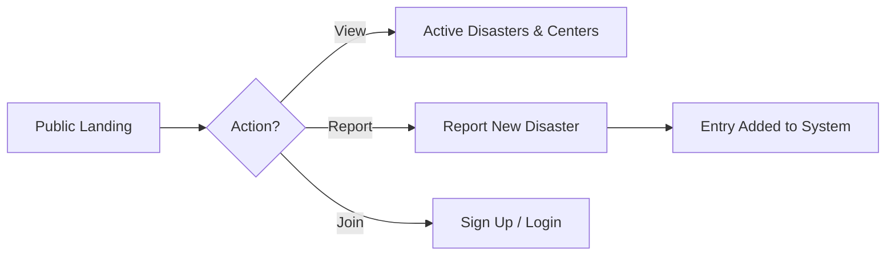
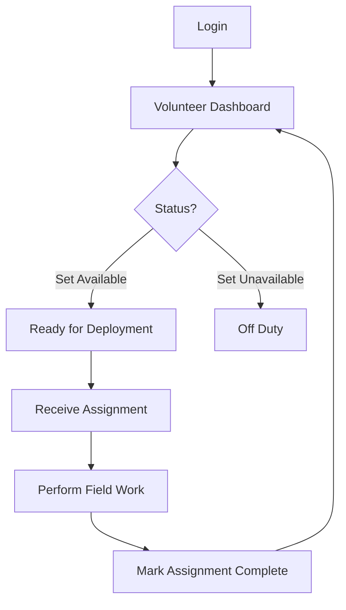
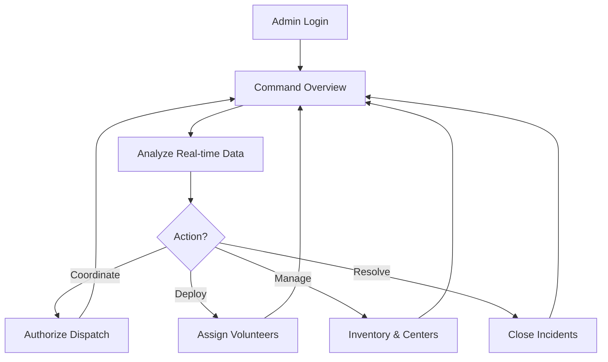

# 🌍 ReliefGrid - Disaster Relief Management Tracker

ReliefGrid is a production-ready, comprehensive platform designed to streamline disaster relief operations. It enables real-time tracking of disasters, efficient management of relief centers, inventory control, and volunteer coordination.


## 🚀 Features

- **📊 Centralized Dashboard**: Real-time overview of active disasters, resource distribution, and relief activities.
- **🚨 Disaster Tracking**: Interactive map and list view for ongoing disasters with severity levels and status updates.
- **🏠 Relief Center Management**: Comprehensive database of relief centers, their locations, and contact details.
- **📦 Inventory & Resource Planning**: Real-time tracking of supplies (food, water, medical kits) across different centers.
- **🚛 Dispatch System**: Coordinate resource movement from centers to affected areas with volunteer assignment.
- **🤝 Volunteer Management**: Track and manage registered volunteers for various relief tasks.
- **🔐 Secure Authentication**: Role-based access control (Admin, Volunteer) with JWT-based security.
- **📱 Responsive Design**: Fully optimized for both desktop and mobile devices.

## 🔄 User Flow

### 1. Guest / Public User


### 2. Volunteer Journey


### 3. Administrator / Command Path


## 🛠 Tech Stack

### Frontend
- **Framework**: React 18 with Vite
- **Styling**: Tailwind CSS & Framer Motion
- **UI Components**: Shadcn UI (Radix UI)
- **State Management**: TanStack Query (React Query)
- **Routing**: React Router DOM v6
- **Maps**: Leaflet & React Leaflet
- **Icons**: Lucide React
- **Data Visualization**: Recharts

### Backend
- **Runtime**: Node.js
- **Framework**: Express.js
- **Database**: MongoDB with Mongoose
- **Security**: JWT & Bcrypt.js
- **CORS Handling**: Configurable origins for production security

## 📁 Project Structure

```text
├── Frontend/           # React application (Vite, TS, Tailwind)
│   ├── src/
│   │   ├── components/ # Reusable UI components
│   │   ├── pages/      # Main application pages
│   │   ├── contexts/   # Auth and Theme contexts
│   │   └── lib/        # Utility functions (axios config, etc.)
├── backend/            # Node.js Express API
│   ├── models/         # Mongoose schemas
│   ├── routes/         # API endpoints
│   ├── controllers/    # Business logic
│   └── middleware/     # Auth and error handling
└── README.md           # This file
```

## 🛠 Getting Started

### Prerequisites
- Node.js (v18 or higher)
- MongoDB (Local or Atlas)
- npm or yarn

### 1. Backend Setup
1. Navigate to the backend directory:
   ```bash
   cd backend
   ```
2. Install dependencies:
   ```bash
   npm install
   ```
3. Create a `.env` file in the `backend/` directory and add the following:
   ```env
   PORT=5000
   MONGO_URI=your_mongodb_connection_string
   JWT_SECRET=your_jwt_secret
   CLIENT_URL=http://localhost:5173
   ```
4. Start the server:
   ```bash
   npm run dev
   ```

### 2. Frontend Setup
1. Navigate to the Frontend directory:
   ```bash
   cd Frontend
   ```
2. Install dependencies:
   ```bash
   npm install
   ```
3. Create a `.env` file in the `Frontend/` directory:
   ```env
   VITE_API_URL=http://localhost:5000/api
   ```
4. Start the development server:
   ```bash
   npm run dev
   ```

## 🌐 Deployment

### Backend (Render/Heroku)
- Push the `backend/` folder to your provider.
- Set environment variables as listed above.
- The backend is configured to handle CORS for production URLs.

### Frontend (Vercel)
- Set the root directory to `Frontend`.
- Set `VITE_API_URL` to your production backend URL.
- Build Command: `npm run build`
- Output Directory: `dist`

## 📄 License
This project is licensed under the MIT License.
